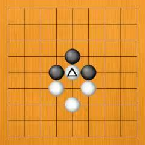
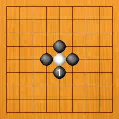
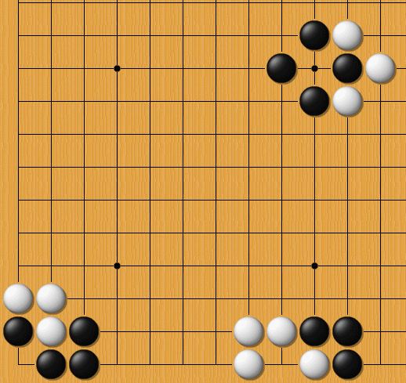

## 引言：一个让围棋差点"死机"的Bug

如果你写过代码，一定遇到过这种情况：程序跑着跑着陷入死循环，CPU狂转，界面卡死，只能强制退出。

围棋在几千年前也遇到了同样的Bug。

棋盘上出现了一种局面——黑白双方你吃我、我吃你，如果允许无限循环下去，这盘棋就永远下不完。古人挠头想了很久，最终拍板：加一条规则，堵住这个漏洞。

这条规则，就叫"劫"。

打劫，本质上就是围棋开发者给这个死循环Bug打的补丁。而这个补丁的奇妙之处在于——它没有简单粗暴地禁止循环，而是把它变成了一场资源消耗战。

下面，我们就用一局"微型劫争"，把打劫的完整流程走一遍。

## 第1步：黑子提劫——Bug被触发了

棋盘上出现这样一个形状：

白棋有一颗子被黑棋围住，只剩最后一口气。黑棋落子，堵上那口气——"啪"的一声，白子被提掉了。

棋盘上少了一颗白子，空出一个交叉点。

现在，Bug出现了：白棋如果立刻把子下在被提掉的那个位置，就能反过来把刚才那颗黑棋也提掉。黑棋再下回去，又提掉白棋……**无限循环**。

为了防止这种情况，规则出手了：

黑棋刚提掉白棋的那个位置，白棋不能立刻下回去。

这就是"劫"的起点。黑棋完成了"提劫"——制造了一个劫争。

## 第2步：白子找劫材——我不能吃你，但我可以吓唬你

白棋现在很郁闷：明明可以回提，规则却不让我下。那怎么办？

规则说：你可以先去棋盘别的地方走一步。 这一步，就叫**"找劫材"**。

什么意思？白棋在棋盘另一处落下一子，威胁要吃黑棋一大片，或者要抢占一块非常重要的地盘。这步棋的分量足够重——重到黑棋如果不管，就会吃大亏。

打个比方：你抢了我的肉，我不能马上抢回来，但我可以一把端起桌上的汤锅，作势要泼掉。你管不管？这锅汤比那块肉值钱多了——这叫"制造更大的麻烦"。

白棋这一步，就是在喊："黑棋你看好了，你要是不管这边，你的大龙就死了！"

## 第3步：黑子应劫——你先解决我的麻烦，我再解决你的麻烦

黑棋低头一看，白棋找的这个"劫材"确实够狠。如果黑棋不管，直接去补那个劫，那白棋在另一边就赚大了——甚至可能直接赢棋。

黑棋只能先回应白棋的"劫材"，在那边落子，把白棋的威胁化解掉。

这一步，叫**"应劫"**——回应对方的劫材。

注意：黑棋应劫之后，棋盘上其他地方发生了变化。此时，规则允许白棋回到最初那个位置，把黑棋提回来了。

因为黑棋已经"在别处走了一步"，满足了规则的"间隔"要求。

于是——

## 第4步：白子提劫——攻守互换

白棋"啪"地落子，提掉了那颗黑棋。局面反转了：

现在轮到黑棋不能立刻回提了。

黑棋也必须去别处找劫材。

白棋则等着看黑棋的"劫材"够不够大。

劫争还在继续，只是攻守双方换了个位置。

## 第5步：黑子找劫材——我也得吓唬你一次

黑棋被提了之后，规则同样禁止他立刻回提。黑棋也得去别处"搞事情"。

黑棋开始寻找自己的劫材：可能是威胁要吃白棋一条大龙，可能是要抢占一个关键的官子，也可能是在某个局部制造第二处劫争，形成"连环劫"的复杂局面。

这一步的质量，直接决定黑棋能不能把劫争继续下去。

**劫材的价值，不在你吃了多少子，而在于对方如果不管，会输多少。**

高手的功力，往往就体现在这一步——能不能找到一枚"刚好够大"的劫材。 太大了浪费，太小了对方可以不理，要恰到好处地卡在对方的痛点上。

## 第6步：白子应劫（或消劫）——两条路摆在你面前

黑棋找的劫材落到棋盘上，白棋面临两个选择：

**选择一：应劫。** 白棋觉得这个威胁必须处理，于是跟着在那边落子回应。这样一来，黑棋获得了回提的机会——劫争继续，双方消耗各自的劫材，像拉锯战一样来回拉扯。

**选择二：消劫。** 白棋觉得黑棋找的这个劫材"不够大"，不值得去管。于是白棋直接落子在那个劫争的位置，彻底结束这场劫争——这一步叫"消劫"或"粘劫"。

消劫意味着：白棋放弃了回应黑棋的威胁，但永久性地赢下了这个劫。作为代价，黑棋在别处占到了便宜。双方各自结算得失。

这个选择，是整场劫争最关键的时刻。消劫还是应劫，就像在问自己：**我手里的筹码够不够跟对方继续赌下去？**

## 第7步：白子消劫——尘埃落定

最终，经过若干轮"找劫材→应劫→提劫"的循环，有一方的劫材先用完了——再也找不到足够大的威胁去逼对方回应。

这时候，另一方就可以"消劫"，把劫争的那个位置粘上，彻底结束战斗。

棋盘上的Bug被修复了，一切回到正常的围地逻辑。

而这场劫争的胜负，可能是几目棋的差距，也可能是一整块棋的生死。

## 劫的本质：不是Bug，是博弈

看到这里你就会发现，围棋里的"劫"虽然诞生于修补Bug，但它没有把这个Bug简单封死，而是把它变成了一种精妙的博弈机制。

找劫材，就是你手里有多少"筹码"可以拿去交换；应劫，就是对方认不认你这个筹码的分量；消劫，就是你判断值不值得继续赌下去。

每一场劫争，都是在问双方三个问题：

1. **你敢不敢开这个劫？**——你有足够的劫材吗？
2. **你舍不舍得跟？**——你的劫材比对方多吗？
3. **你什么时候停？**——是消劫收手，还是继续消耗？

高手之间的劫争，往往不是单纯的算力比拼，而是**筹码、胆识和判断力**的三重对决。

下次看围棋比赛，听到解说激动地喊"开劫了！"，你就知道——好戏才刚刚开始。
