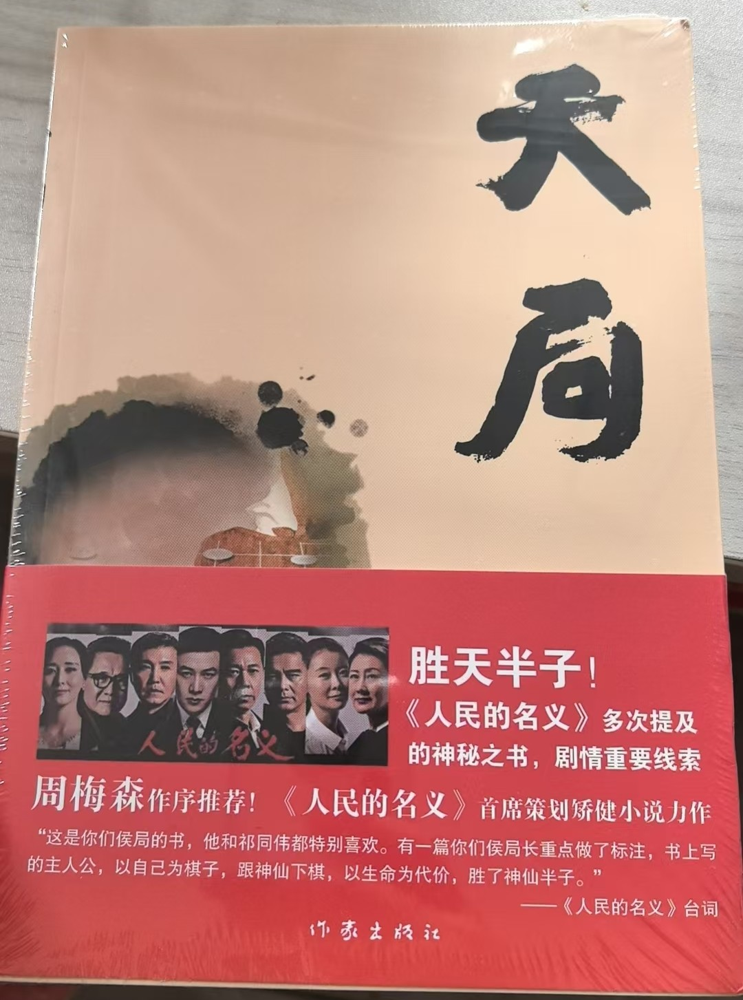
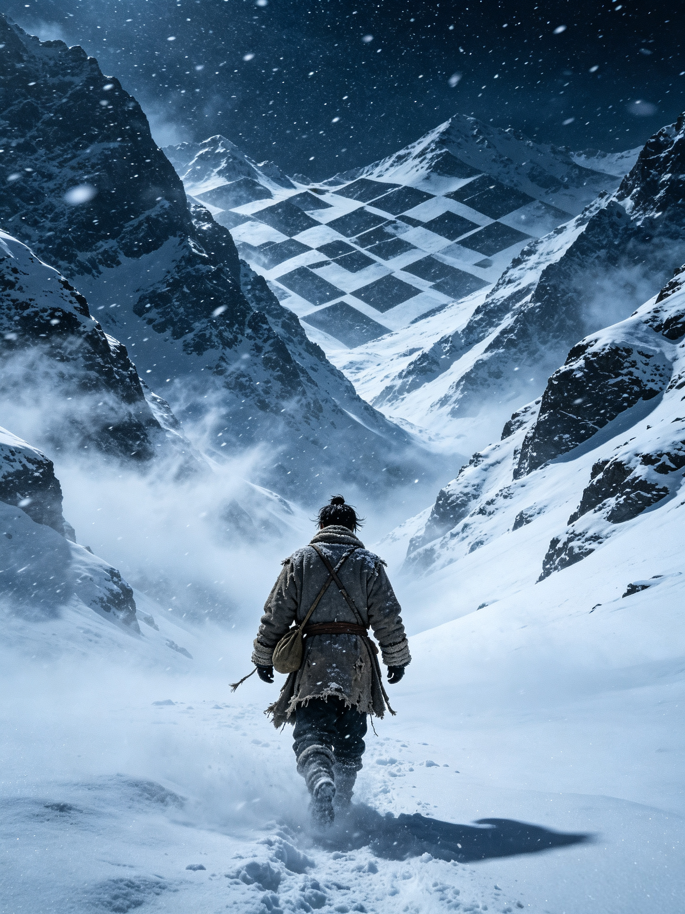
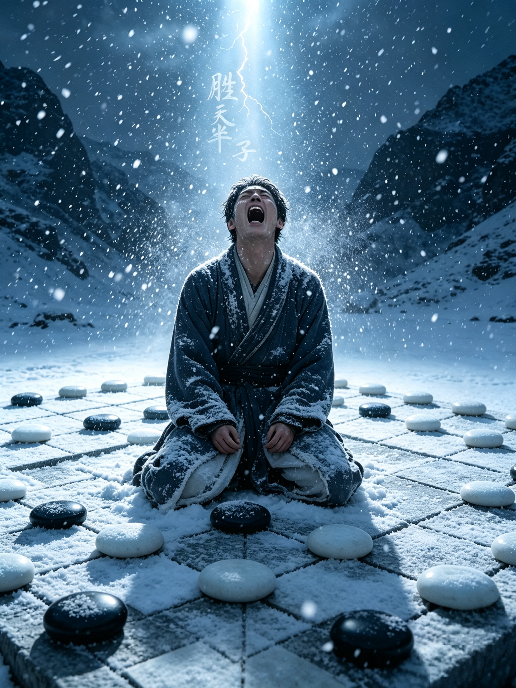
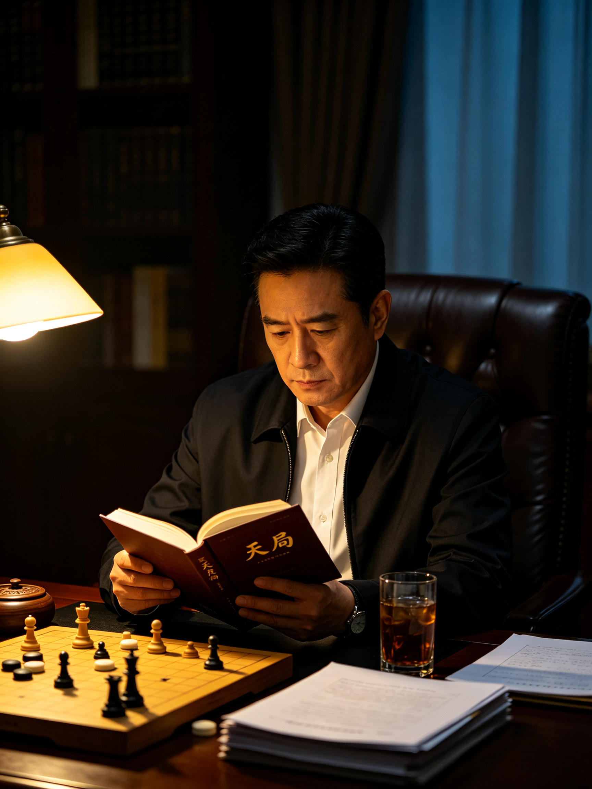

全篇核心就是一盘决定命运的围棋劫争，主人公叫**浑沌**，一个痴迷围棋的普通乡下人。

## 故事完整经过

### 开端：误入天局

大年三十风雪夜，浑沌背着猪头，赶路去找棋友下棋，大雪迷路，闯进了当地的迷魂谷。

这片山谷地面平整方正，天然就是一块巨型棋盘，地上散落黑石，白雪留白。风雪困住他，走不出去。

恍惚间进入幻境，山谷化作一间茅屋，帐内坐着一位看不见面容的对手，便是"天"——代表既定的命运，要和他下一盘生死棋局。

规则就是围棋，浑沌执黑子，天执白子。**这一局，输赢定生死。**

### 中盘鏖战

开局之后，对方棋路冰冷无情，步步精准，没有一丝人情。浑沌独自苦战，渐渐落入下风。恍惚间，历代逝去的围棋高手虚影浮现，暗中帮他斟酌落子，双方来回厮杀，黑白交错。

一路缠斗，所有大场、实地全部走完，棋局来到收官阶段，整盘棋的胜负，**全部卡在最后一处劫争上**——也就是打劫。

### 关键：打劫博弈（以身入局就在此处）

1. **白子（天）率先提劫**，主动权在天道一方。
2. 按照围棋规矩，浑沌不能立刻回提，必须不断去**找劫材**——在棋盘别处落子，逼迫对方应劫，才有机会回头抢劫。
3. 浑沌接连出手，用尽了自己所有劫材，也用完了历代棋仙能给出的全部劫招。

清点之后：**黑子劫材，比白子少最后一枚。**

> 通俗翻译：正常落子的情况下，他找不出新的威胁点了。只要走完现有劫材，再无后手，这个劫必输，整盘棋直接落败，他便会葬身山谷。

### 以身入局，舍身做劫材（核心一幕）

就在棋局僵持不下时，一众棋仙示意他：**以身做劫。**

意思直白来讲：常规棋子已经用完，没有劫材可以再下。那就把自己的性命，当成**最后一手劫材**。

浑沌心里清楚代价。他走出茅屋幻境，来到山谷棋盘右下角，整个人笔直跪在劫位那一点上。

**在棋局逻辑里**：他跪在棋盘上，自身化作一枚活生生的黑子。这一手落子，就是那最后唯一的劫材。

放到打劫流程里完整顺序：

1. 白（天）提劫；
2. 黑子所有普通劫材耗尽；
3. **浑沌以身入局，人落在棋盘劫点，走出终极劫材；**
4. 天道看到这一手劫材。如果不应劫，浑沌这颗"活人棋子"落定，劫直接拿下，全盘取胜；
5. 天衡量得失，若是跟他硬拼，就要付出更大代价。权衡过后，**天道选择不应劫，放弃此劫。**

### 结局：胜天半子

天主动收手，不再继续打劫，等于在这一处劫上认输。

整盘棋算下来，黑子只微弱胜出半子。

> 天亮以后，村民进山寻人，在迷魂谷发现浑沌。地上黑石、白雪排布成完整棋局，**浑沌跪在棋盘右下角的劫点上，早已在寒夜里冻僵离世。**
>
> 旁人看不懂棋局，只有懂棋的人一数棋：浑沌胜天半子。

## 深层含义（为什么祁同伟执念这句话）

**1. 胜天半子，不是全盘大胜，只是险胜一丝。**
赢了棋局，却搭上自己性命，属于惨胜。

**2. 以身入局的本质：普通人对抗既定命运。**
天道好比早已写好的人生剧本，正常按规矩走，必输。想要翻盘，就不能只用常规棋子，要把自己整个人押进棋局，赌上一生。

**3. 悲剧内核：哪怕险胜半子，自身也已经入局，沦为棋子，终究逃不出大局。**

> 世事如棋，人海茫茫，人与人之间相互试探，相互倾轧。
>
> 不敢入局，难觅生机；以身入局，胜天半子。
