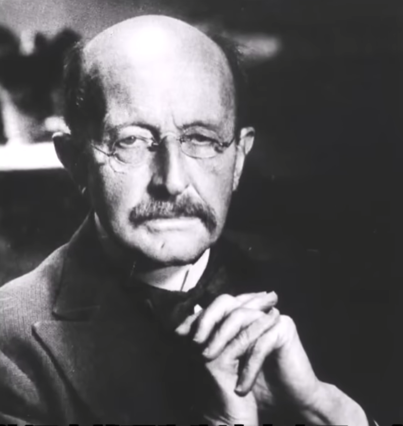
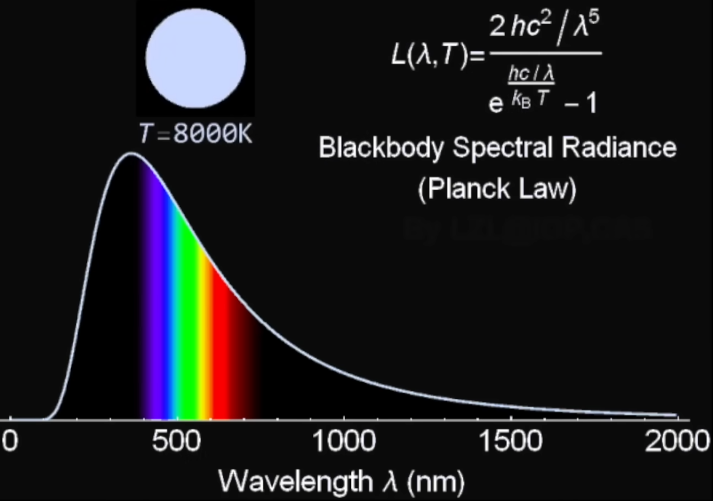

亲爱的朋友，请坐。我是马克斯·普朗克，一个研究热与光的物理学家。让我试着用一种简单的方式，告诉你这个让我自己也困惑了很久的发现——**量子**。

你想象一下，我们通常觉得，水从水管里流出来，是连续不断的；你给炉子加热，温度好像也是一点点平稳上升的。在我年轻的时候，全世界的物理学家都理所当然地认为，能量也是这样——像一股滑润的水流，可以无限分割，想多小就多小，中间没有间隔。

但当我在研究烧红的铁块为什么会发出那种暗红到橙黄的光时，所有精妙的计算都失败了。我们无法解释光的颜色和能量分布。就在1900年，为了得出正确的答案，我不得不做出一个极其大胆、甚至让我自己都感到不安的假设。

这个假设就是：**能量在发射或吸收时，不是连续的水流，而更像是从沙漏里漏下的沙子，是一粒一粒、一份一份地进行的。**

也就是说，能量存在一个最小的、不可再分的基本单位。就像一个孩子爬楼梯，他只能站在第一级、第二级、第三级上，绝不可能悬空踩在两级台阶之间的半空中。能量的交换，也只能是这个基本单位的整数倍：一份，两份，三份……绝不可能出现半份。

我把这最小的一份能量，称为一个**"能量子"**。而"量子"这个词，指的就是这种"一份份"的不连续性质。它不是某种具体的粒子，而是自然界在最底层必须遵守的一种"打包"规则。

更奇妙的是，我发现每一份量子所携带的能量，并不是固定不变的。它和光的"振动快慢"——也就是光的颜色（频率）——成正比。蓝光振动得快，它的能量子就大一些；红光振动得慢，它的能量子就小一些。用一个简单的公式来说，就是：

$$E = h \cdot \nu$$

那个小小的 $h$，就是我不得不引入的"普朗克常数"，它就像是自然界的换算标尺，标示着这种颗粒性有多细微。

坦白说，这个发现最初让我非常不安。我花了好几年时间试图把我的"量子"塞回经典物理的连续图像里去，但每一次都失败了。因为无论是固体加热发光，还是后来爱因斯坦解释的光电效应，都反复证明，光的行为就像一颗颗的"光量子"（现在叫光子）；再后来，人们甚至发现，连原子里的电子也只能占据特定的"台阶"，不得随意滑动。

所以，如果你要我用一句话来向您解释什么是量子，我会说：

> **量子，就是大自然在微观世界里执行交易的"最小硬币单位"。** 我们的世界在表面上看着平滑流畅，但在最细微的尺度上，它其实是由无数个不可分割的能量台阶、光粒子、作用量单元拼接起来的。能量不再是滑溜溜的果冻，而是一袋袋分装好的面粉。

这个想法震撼了我，也最终改变世界。希望这能让你看到，我们所生活的宇宙，在最深处其实是一幅由无数"量子"颗粒编织而成的奇妙画卷。

---

## 后记

亲爱的读者，当您读完这篇文字，请允许我坦白一件事：以上并非普朗克本人写于1900年的手稿，而是一篇虚构的演绎。真正的马克斯·普朗克确实提出了量子假说，但他当时称之为"纯粹形式上的假设"，甚至是一个**"绝望之举"**——他本人曾多年试图推翻它，却未能成功。后来，这项发现为物理学打开了新的大门，也为他赢得了1918年诺贝尔物理学奖。

文中那个简洁的公式 $E = h \cdot \nu$，是真实的。它说的是能量以一份份"零钱"的形式出现，而非无限可分的洪流。但请切记，量子是自然界最底层的计数规则，不应被附会上任何神秘主义解读。它既不证明心灵感应，也不暗示宇宙是幻象——它只是宇宙对自己最诚实的账目。

若您对这个由"零钱"砌成的世界产生了好奇，不妨继续去了解爱因斯坦的光电效应、玻尔的原子模型。那会是一场更加惊奇的旅程。感谢您耐心读完！
